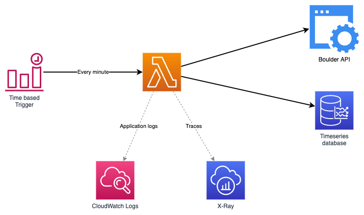

# SAM Boulder-Watcher

Watches the crowd level of the BoulderWelt East and West.


## Architecture overview



## Sample boulder API request
```
curl --location \
     --form 'action="cxo_get_crowd_indicator"' \
     --request POST \
     'https://www.boulderwelt-muenchen-west.de/wp-admin/admin-ajax.php'
```
